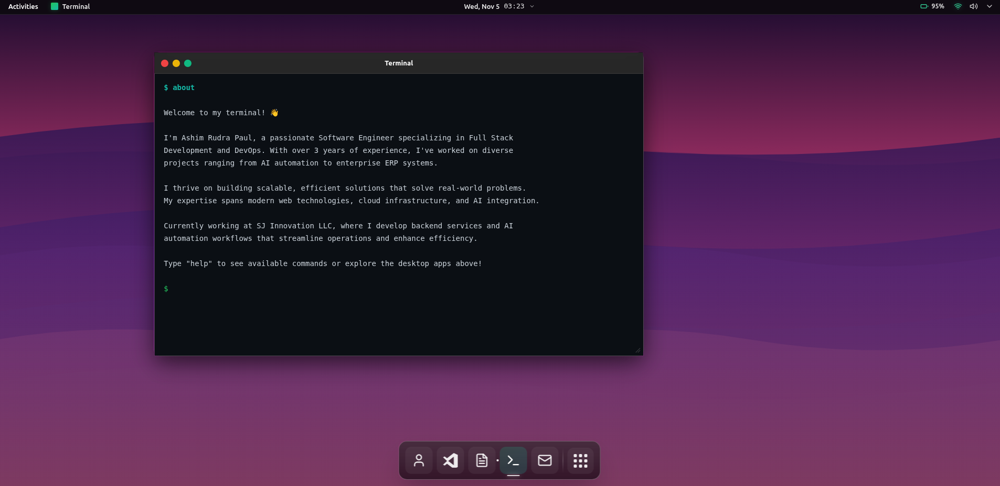

# Ashim OS - Portfolio Website

<div align="center">

[](https://nextjs.org/)
[](https://www.typescriptlang.org/)
[](https://tailwindcss.com/)
[](LICENSE)

</div>

A modern, interactive portfolio website designed as an operating system interface. Built with Next.js 14, TypeScript, and Tailwind CSS.

> **Live Demo**: [dev.ashimrudrapaul.com](https://dev.ashimrudrapaul.com/)

<div align="center">
  
  <p><i>Desktop interface with interactive terminal and application dock</i></p>
</div>

## 📑 Table of Contents

- [Features](#-features)
- [Tech Stack](#️-tech-stack)
- [Prerequisites](#-prerequisites)
- [Installation](#-installation)
- [Project Structure](#️-project-structure)
- [Configuration](#️-configuration)
- [Customization](#-customization)
- [Analytics & Monitoring](#-analytics--monitoring)
- [Keyboard Shortcuts](#-keyboard-shortcuts)
- [Development Scripts](#-development-scripts)
- [Building for Production](#-building-for-production)
- [Deployment](#-deployment)
- [FAQ](#-faq-frequently-asked-questions)
- [Troubleshooting](#-troubleshooting)
- [Contributing](#-contributing)
- [Security](#-security)
- [License](#-license)
- [Author](#-author)
- [Acknowledgments](#-acknowledgments)
- [Changelog](#-changelog)

## 🚀 Features

### Core Features
- **OS-Style Interface**: Fully interactive desktop environment inspired by modern operating systems
- **Window Management**: Draggable, resizable windows with minimize, maximize, and close functionality
- **Boot Sequence**: Authentic OS boot animation on first load
- **Desktop Applications**: Multiple built-in apps (About, Projects, Resume, Terminal, Contact)
- **Terminal Emulator**: Functional terminal with custom commands (help, about, skills, clear, etc.)
- **Command Palette**: Quick access to all features via keyboard shortcuts (`Cmd/Ctrl + K`)
- **Context Menu**: Right-click context menu for desktop interactions

### User Experience
- **Responsive Design**: Fully responsive layout that works on desktop and mobile devices
- **Smooth Animations**: Powered by Framer Motion for fluid transitions
- **Dark Theme**: Professional dark mode design optimized for readability
- **Keyboard Navigation**: Full keyboard support with intuitive shortcuts
- **Persistent State**: Window positions and app states saved using Zustand

### Technical Excellence
- **Performance Optimized**: React.memo, useCallback, and efficient state management
- **SEO Ready**: Comprehensive meta tags, Open Graph, and Twitter Card support
- **Type Safety**: Full TypeScript implementation with strict mode enabled
- **Code Quality**: ESLint configuration for code consistency
- **Error Handling**: React Error Boundary for graceful error recovery
- **Analytics Ready**: Built-in structure for analytics integration
- **Accessibility**: WCAG compliant with proper ARIA labels and semantic HTML

## 🛠️ Tech Stack

- **Framework**: Next.js 14.0.4 (App Router)
- **Language**: TypeScript 5.3.3
- **Styling**: Tailwind CSS 3.3.6
- **State Management**: Zustand 4.4.7
- **Animations**: Framer Motion 10.16.16
- **UI Components**: Lucide React 0.294.0, CMDK 0.2.0
- **Code Quality**: ESLint 8.56.0

## 📋 Prerequisites

Before you begin, ensure you have the following installed:

- **Node.js**: Version 18.x or higher ([Download](https://nodejs.org/))
- **npm**: Version 9.x or higher (comes with Node.js)
- **Git**: For cloning the repository ([Download](https://git-scm.com/))

Optional but recommended:
- **yarn** or **pnpm** as alternative package managers

## 📦 Installation

```bash
# Clone the repository
git clone https://github.com/codewithashim/Dev-Ashim.git

# Navigate to the project directory
cd Dev-Ashim

# Install dependencies
npm install
# or
yarn install
# or
pnpm install

# Run development server
npm run dev
# or
yarn dev
# or
pnpm dev
```

Open [http://localhost:3000](http://localhost:3000) in your browser.

### 🚀 Quick Start

```bash
# Quick installation and start
git clone https://github.com/codewithashim/Dev-Ashim.git && cd Dev-Ashim && npm install && npm run dev
```

That's it! Your portfolio will be running at `http://localhost:3000`

## 🏗️ Project Structure

```
src/
├── app/                    # Next.js app directory
│   ├── globals.css        # Global styles
│   ├── layout.tsx         # Root layout with metadata
│   └── page.tsx           # Home page
├── features/              # Feature-based modules
│   ├── about/            # About application
│   ├── boot/             # Boot loader animation
│   ├── contact/          # Contact application
│   ├── desktop/          # Desktop environment
│   ├── projects/         # Projects showcase
│   ├── resume/           # Resume viewer
│   ├── terminal/         # Terminal emulator
│   └── window/           # Window management
└── shared/               # Shared resources
    ├── components/       # Reusable components
    │   ├── CommandPalette.tsx
    │   ├── ContextMenu.tsx
    │   └── ErrorBoundary.tsx
    ├── constants/        # App constants
    ├── data/            # Portfolio data
    ├── hooks/           # Custom React hooks
    │   ├── useClickOutside.ts
    │   ├── useDesktopStore.ts
    │   ├── useKeyboardShortcut.ts
    │   ├── useLocalStorage.ts
    │   └── useWindowSize.ts
    ├── lib/             # Utility libraries
    │   ├── analytics.ts
    │   └── logger.ts
    ├── types/           # TypeScript types
    └── utils/           # Utility functions
```

## ⚙️ Configuration

### Environment Variables (Optional)

This project works without environment variables, but you can add them for additional features:

Create a `.env.local` file in the root directory:

```env
# Site URL (for production)
NEXT_PUBLIC_SITE_URL=https://your-domain.com

# Analytics (if you want to add analytics)
NEXT_PUBLIC_GA_ID=your-google-analytics-id

# Other optional variables
NODE_ENV=development
```

**Note**: Environment variables prefixed with `NEXT_PUBLIC_` are exposed to the browser.

### Portfolio Data

Customize your portfolio by editing `src/shared/data/portfolio.ts`:

```typescript
export const portfolioData: PortfolioData = {
  name: 'Your Name',
  title: 'Your Title',
  phone: 'Your Phone',
  email: 'your.email@example.com',
  location: 'Your Location',
  portfolio: 'https://your-site.com',
  linkedin: 'https://linkedin.com/in/yourprofile',
  github: 'https://github.com/yourusername',
  about: ['Array of strings for your about section'],
  skills: [
    {
      category: 'Frontend',
      items: 'React, Next.js, TypeScript, etc.'
    },
    // ... more skills
  ],
  experience: [
    {
      company: 'Company Name',
      position: 'Your Position',
      location: 'Location',
      period: 'Start - End',
      type: 'Full-Time/Contract',
      responsibilities: ['List of responsibilities']
    },
    // ... more experience
  ],
  projects: [
    {
      id: 'project-id',
      name: 'Project Name',
      description: 'Short description',
      tech: ['Tech', 'Stack'],
      link: 'https://project-url.com',
      highlights: ['Key features and achievements']
    },
    // ... more projects
  ],
  education: 'Your Education Details'
}
```

### App Metadata

Update site metadata in `src/shared/constants/index.ts`:

```typescript
export const APP_METADATA = {
  title: 'Your Name - Software Engineer',
  description: 'Your portfolio description',
  keywords: ['Your', 'Keywords', 'Here'],
  author: 'Your Name',
  siteUrl: 'https://your-domain.com',
  ogImage: '/og-image.png',
}
```

**Example (Current Configuration):**
```typescript
export const APP_METADATA = {
  title: 'Ashim Rudra Paul - Software Engineer',
  description: 'Portfolio website of Ashim Rudra Paul - Full Stack Developer & DevOps Engineer',
  keywords: ['Ashim Rudra Paul', 'Software Engineer', 'Full Stack Developer', 'DevOps', 'Portfolio'],
  author: 'Ashim Rudra Paul',
  siteUrl: 'https://dev.ashimrudrapaul.com',
  ogImage: '/og-image.png',
}
```

## 🎨 Customization

### Theme Colors

Edit colors in `tailwind.config.ts`:

```typescript
colors: {
  'os-bg': '#0b0f14',
  'os-surface': '#161b22',
  'os-border': '#30363d',
  'os-text': '#c9d1d9',
  'os-text-muted': '#8b949e',
  'os-accent-green': '#22c55e',
  'os-accent-teal': '#14b8a6',
  'os-accent-red': '#ef4444',
  'os-accent-yellow': '#eab308',
}
```

### Available Applications

The portfolio includes the following desktop applications:

1. **About** - Personal introduction and background
2. **Projects** - Showcase of featured projects (LipikaAI, Paige's Office, ZeeWork)
3. **Resume** - Professional experience and skills
4. **Terminal** - Interactive terminal with custom commands
5. **Contact** - Contact information and social links

### Custom Hooks

The project includes several reusable custom hooks in `src/shared/hooks/`:

- **`useDesktopStore`**: Zustand store for managing desktop state (windows, apps, focus)
- **`useClickOutside`**: Detects clicks outside of a referenced element
- **`useKeyboardShortcut`**: Registers and handles keyboard shortcuts
- **`useLocalStorage`**: Persist state to localStorage with React hooks
- **`useWindowSize`**: Tracks window dimensions for responsive behavior

### Adding New Apps

1. Create a new feature directory under `src/features/your-app/`
2. Create the app component in `components/YourApp.tsx`
3. Export it from `index.ts`
4. Add the app type to `AppId` in `src/shared/types/index.ts`
5. Register it in the dock at `src/features/desktop/components/Dock.tsx`

Example app structure:
```
src/features/my-app/
├── components/
│   └── MyApp.tsx
├── hooks/              # Optional: app-specific hooks
│   └── useMyAppLogic.ts
└── index.ts           # Export your app
```

## 📊 Analytics & Monitoring

The project includes built-in infrastructure for:

- **Error Tracking**: React Error Boundary component (`src/shared/components/ErrorBoundary.tsx`)
- **Logging System**: Centralized logger utility (`src/shared/lib/logger.ts`)
- **Analytics Ready**: Analytics module structure (`src/shared/lib/analytics.ts`)

These components provide a foundation for integrating services like:
- Google Analytics / Plausible for page views and events
- Sentry for error tracking and performance monitoring
- Custom analytics solutions

### Enabling Analytics

Update `src/shared/lib/analytics.ts` with your preferred analytics provider:

```typescript
export const trackEvent = (eventName: string, properties?: Record<string, any>) => {
  // Add your analytics implementation
  // Example: window.gtag('event', eventName, properties)
}
```

## 🔑 Keyboard Shortcuts

- `Cmd/Ctrl + K`: Open command palette
- `` ` ``: Open terminal
- `Esc`: Close modals and dialogs
- `Arrow Keys`: Navigate in command palette

## 🧪 Development Scripts

```bash
# Run development server
npm run dev

# Run linting
npm run lint

# Build for production
npm run build

# Start production server
npm start

# Export static site
npm run export
```

## 📦 Building for Production

```bash
# Create production build
npm run build

# Start production server
npm start
```

## 🚀 Deployment

### Vercel (Recommended)

The easiest way to deploy this Next.js app is using [Vercel](https://vercel.com):

[](https://vercel.com/new/clone?repository-url=https://github.com/codewithashim/Dev-Ashim)

1. Push your code to GitHub
2. Import your repository to Vercel
3. Vercel will automatically detect Next.js and configure settings
4. Your site will be live in minutes!

### Other Platforms

The project can be deployed to any platform that supports Next.js:

#### Netlify
```bash
# Build command
npm run build

# Publish directory
.next
```

#### AWS Amplify
- Framework: Next.js - SSR
- Build command: `npm run build`
- Build output directory: `.next`

#### Docker
Create a `Dockerfile` for containerized deployment:
```dockerfile
FROM node:18-alpine
WORKDIR /app
COPY package*.json ./
RUN npm install
COPY . .
RUN npm run build
EXPOSE 3000
CMD ["npm", "start"]
```

#### Static Export
For static hosting (GitHub Pages, Netlify, etc.):
```bash
npm run export
```
This generates a static site in the `out` directory.

## ❓ FAQ (Frequently Asked Questions)

### General Questions

**Q: Can I use this template for my own portfolio?**  
A: Absolutely! This project is open source under the MIT License. Feel free to fork it and customize it for your needs.

**Q: Do I need to know React to customize this?**  
A: Basic React and TypeScript knowledge is recommended. However, you can customize the content without deep React knowledge by editing the `portfolio.ts` file.

**Q: Is this mobile-friendly?**  
A: Yes! The entire interface is fully responsive and works great on mobile devices, tablets, and desktops.

**Q: How do I deploy this to production?**  
A: The easiest way is using Vercel (see [Deployment](#-deployment) section). You can also deploy to Netlify, AWS, or any platform that supports Next.js.

### Technical Questions

**Q: Why Next.js over plain React?**  
A: Next.js provides better SEO, faster page loads, and built-in routing. It's perfect for portfolio sites that need to be discoverable.

**Q: Can I add a blog to this portfolio?**  
A: Yes! You can add a new app/feature following the structure in `src/features/`. We have plans for a blog feature in v1.1.0.

**Q: How do I add Google Analytics?**  
A: Edit `src/shared/lib/analytics.ts` and add your GA tracking code. See the [Analytics](#-analytics--monitoring) section for details.

**Q: Can I use this with Vue or Angular?**  
A: The current implementation is React-specific. However, you can adapt the concepts and UI design to other frameworks.

**Q: How do I change the color scheme?**  
A: Edit the colors in `tailwind.config.ts`. See the [Customization](#-customization) section for details.

**Q: Is there a CMS option for managing content?**  
A: Currently, content is managed through the `portfolio.ts` file. CMS integration could be added as a custom feature.

## 🔧 Troubleshooting

### Common Issues

#### Port 3000 Already in Use
```bash
# Use a different port
PORT=3001 npm run dev
```

#### Module Not Found Errors
```bash
# Clear node_modules and reinstall
rm -rf node_modules package-lock.json
npm install
```

#### Type Errors After Update
```bash
# Clear Next.js cache
rm -rf .next
npm run dev
```

#### Build Fails
```bash
# Check for linting errors
npm run lint

# Build with verbose output
npm run build --verbose
```

### Performance Tips

1. **Optimize Images**: Use Next.js Image component for better performance
2. **Lazy Loading**: Components are already optimized, but you can add more lazy loading as needed
3. **Bundle Analysis**: Add `@next/bundle-analyzer` to analyze bundle size
4. **Caching**: Enable Redis or similar caching for production

### Browser Support

- **Chrome/Edge**: Latest 2 versions ✅
- **Firefox**: Latest 2 versions ✅
- **Safari**: Latest 2 versions ✅
- **Mobile Browsers**: iOS Safari, Chrome Mobile ✅

## 🤝 Contributing

Contributions are welcome! Please read our [Contributing Guidelines](CONTRIBUTING.md) for details on our code of conduct and the process for submitting pull requests.

### Quick Start for Contributors

1. Fork the repository at [github.com/codewithashim/Dev-Ashim](https://github.com/codewithashim/Dev-Ashim)
2. Clone your fork: `git clone https://github.com/YOUR_USERNAME/Dev-Ashim.git`
3. Create your feature branch (`git checkout -b feature/AmazingFeature`)
4. Make your changes following our coding standards
5. Test your changes thoroughly
6. Commit your changes (`git commit -m 'feat: add amazing feature'`)
7. Push to the branch (`git push origin feature/AmazingFeature`)
8. Open a Pull Request

Please ensure your PR:
- Follows the existing code style
- Includes appropriate documentation
- Has been tested across different browsers
- Follows [Conventional Commits](https://www.conventionalcommits.org/) specification

## 🔒 Security

Security is a priority for this project. If you discover a security vulnerability, please follow our [Security Policy](SECURITY.md) for responsible disclosure.

### Security Features

- **Type Safety**: Full TypeScript coverage prevents common runtime errors
- **Input Validation**: Proper validation for user inputs
- **XSS Protection**: React's built-in XSS protection
- **Dependency Updates**: Regular dependency updates for security patches
- **Error Boundaries**: Graceful error handling prevents information leakage

## 📄 License

This project is open source and available under the [MIT License](LICENSE).

## 👤 Author

**Ashim Rudra Paul**

- Website: [dev.ashimrudrapaul.com](https://ashimrudrapaul.com/)
- GitHub: [@codewithashim](https://github.com/codewithashim)
- LinkedIn: [ashimrudrapaul](https://linkedin.com/in/codewithashim)
- Email: [codewithashim@gmail.com](mailto:codewithashim@gmail.com)

## 🙏 Acknowledgments

This project was built with the help of amazing open-source tools and inspiration:

### Technologies
- **[Next.js](https://nextjs.org/)** - The React framework for production
- **[TypeScript](https://www.typescriptlang.org/)** - JavaScript with syntax for types
- **[Tailwind CSS](https://tailwindcss.com/)** - A utility-first CSS framework
- **[Framer Motion](https://www.framer.com/motion/)** - Production-ready animation library
- **[Zustand](https://github.com/pmndrs/zustand)** - Bear necessities for state management
- **[Lucide](https://lucide.dev/)** - Beautiful & consistent icon toolkit
- **[CMDK](https://cmdk.paco.me/)** - Fast, composable command menu

### Inspiration
- **macOS** - Window management and UI design patterns
- **Ubuntu** - Terminal aesthetics and boot sequence
- **Modern Web OS Projects** - Various open-source portfolio projects

### Special Thanks
- All contributors and users of this project
- The Next.js and React communities
- Open source maintainers who make projects like this possible

## 📝 Changelog

### Version 1.0.0 (November 2024)

#### Features
- ✨ Initial public release
- 🖥️ OS-style desktop interface with window management system
- 📱 Fully responsive design for mobile and tablet devices
- 🪟 Five core applications: About, Projects, Resume, Terminal, Contact
- ⌨️ Command palette with keyboard shortcuts (Cmd/Ctrl + K)
- 🖱️ Context menu for right-click interactions
- 🚀 Boot sequence animation on first load
- 💾 Persistent state management with Zustand

#### Performance
- ⚡ React.memo optimization for expensive components
- 📦 Code splitting and lazy loading
- 🎯 Optimized bundle size with tree shaking
- 💨 Fast page loads with Next.js App Router

#### Developer Experience
- 📘 Full TypeScript coverage with strict mode
- 🔧 ESLint configuration for code quality
- 📁 Feature-based architecture for scalability
- 🎨 Tailwind CSS for rapid UI development
- 🔄 Hot module replacement for faster development

#### SEO & Accessibility
- 🔍 Complete meta tags and Open Graph support
- ♿ WCAG compliant with ARIA labels
- 🎹 Full keyboard navigation support
- 📱 Mobile-friendly and touch-optimized

#### Infrastructure
- 🐛 Error boundary for graceful error handling
- 📊 Analytics structure ready for integration
- 📝 Comprehensive logging system
- 🔒 Security best practices implemented

### Roadmap (Future Versions)

#### v1.1.0 (Planned)
- [ ] Multi-theme support (light/dark/custom themes)
- [ ] More terminal commands and easter eggs
- [ ] Blog/Articles app integration
- [ ] Skills visualization with interactive charts

#### v1.2.0 (Planned)
- [ ] Real-time collaboration features
- [ ] Guest book or comments system
- [ ] Achievement/badge system
- [ ] Export resume as PDF feature

#### v2.0.0 (Future)
- [ ] Multi-language support (i18n)
- [ ] Desktop customization (wallpapers, icons)
- [ ] Plugin system for extending functionality
- [ ] PWA support for offline access

Want to contribute to these features? Check out our [Contributing Guidelines](CONTRIBUTING.md)!

---

Made with ❤️ by Ashim Rudra Paul
